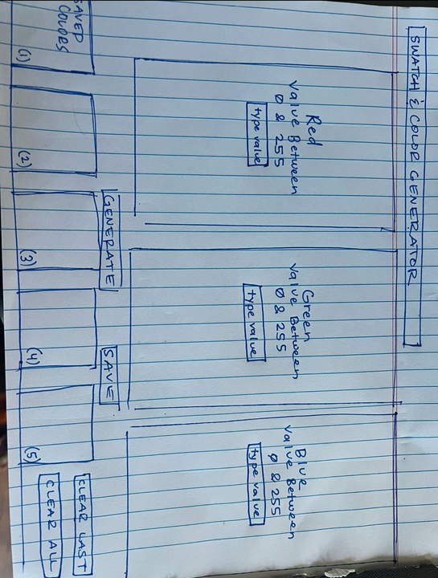
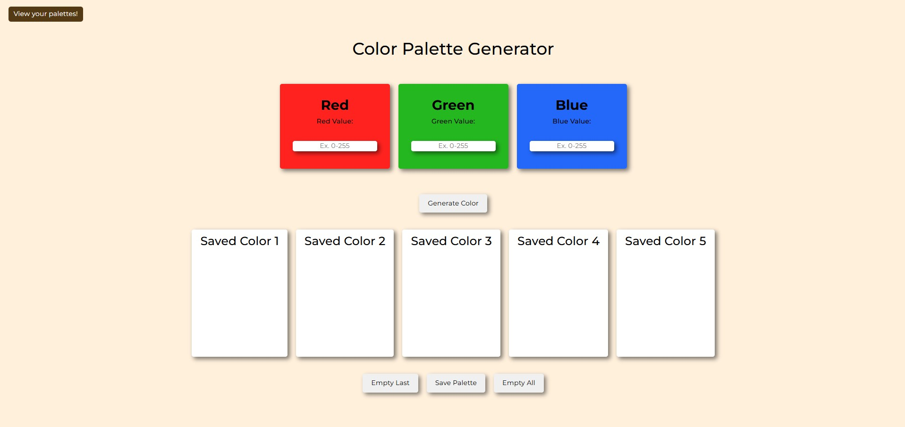
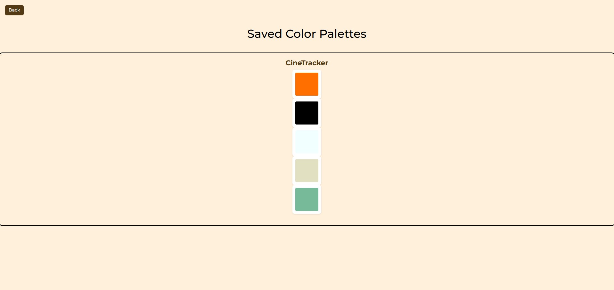

# Color Palette Generator

## Description

The Color Palette Generator project allows website developers and users to practice Color Theory by generating custom RGB colors. The user can input specific values for the Red, Green, and Blue components (ranging from 0 to 255) to create a unique color. The user can create five colors, forming a custom color palette. This palette can then be saved to Local Storage and displayed on a separate page, making it useful for future design projects or experimentation with color combinations.

This project demonstrates the practical application of Color Theory, where users have full control over the RGB color values and can see the results visually. It emphasizes the creation of interactive web pages using JavaScript, Local Storage, and front-end design techniques.

## Table of Contents

- [Usage](#usage)
- [Mock Up](#mock-up)
- [Instructions](#instructions)
- [Key Features](#key-features)
- [Technology Stack](#technology-stack)
- [Additional Resources](#additional-resources)

## Usage

To start the application, open the `index.html` file in a web browser. Users can input RGB values to generate colors. Once five colors are selected, click the "Save Palette" button to store the palette in Local Storage, and navigate to the palette page to view your saved palette.

## Mock-Up

## Instructions

1. Clone or download the repository.

2. Open `index.html` in your preferred web browser.

3. Enter RGB values for Red, Green, and Blue (each between 0 and 255).

4. After entering values, click "Create Color" to generate a color.

5. Repeat this process five times to create a palette.

6. Click "Save Palette" to save your color palette to Local Storage.

7. Navigate to the palette page to view your saved palette.

## Key Features

- **Custom Color Generation**: Allows users to input RGB values to create a specific color.

- **Palette Creation**: Users can generate up to five custom colors to form a palette.

- **Local Storage**: Palettes are stored in Local Storage, ensuring they persist between page reloads and can be displayed on a separate page.

- **Interactive UI**: The user interface provides real-time feedback as users input RGB values, making the tool intuitive and easy to use.

## Technology Stack

This project relies on the following tools and technologies:

- **HTML/CSS**: For structuring and styling the page, creating an engaging user interface.

- **JavaScript**: For creating the interactive functionality, including generating colors and saving palettes to Local Storage.

- **Local Storage**: Used to persist color palettes between page reloads.

- **Bootstrap**: For responsive design and layout.

## Additional Resources

- GitHub repository: [https://github.com/gilmerperez/color-palette-generator](https://github.com/gilmerperez/color-palette-generator)

- Deployed Application: [https://gilmerperez.github.io/color-palette-generator/](https://gilmerperez.github.io/color-palette-generator/)

- Bootstrap Documentation: [Bootstrap Documentation](https://getbootstrap.com/)

- JavaScript Local Storage Guide: [JavaScript Local Storage Guide](https://developer.mozilla.org/en-US/docs/Web/API/Window/localStorage)
